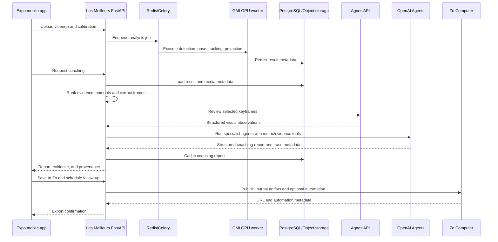

# Les Meilleurs Sponsor Integration Plan

Status: implementation blueprint; none of the sponsor-specific integrations described here should be assumed to exist until its acceptance criteria are verified.

Last updated: 2026-07-31

Audience: engineers, coding agents, product designers, demo presenters, and reviewers who need to understand or implement the integrations without relying on prior conversation context.

## Navigation

- [1. Executive summary](#1-executive-summary)
- [2. Important repository facts](#2-important-repository-facts)
- [3. Goals and non-goals](#3-goals-and-non-goals)
- [4. Design principles](#4-design-principles)
- [5. Target end-to-end workflow](#5-target-end-to-end-workflow)
- [6. Shared data contracts](#6-shared-data-contracts)
- [7. GMI Cloud integration](#7-gmi-cloud-integration)
- [8. Agnes integration](#8-agnes-integration)
- [9. OpenAI integration](#9-openai-integration)
- [10. Zo Computer integration](#10-zo-computer-integration)
- [11. Backend architecture changes](#11-backend-architecture-changes)
- [12. Mobile architecture and UX](#12-mobile-architecture-and-ux)
- [13. Endpoint plan](#13-endpoint-plan)
- [14. Configuration plan](#14-configuration-plan)
- [15. Test plan](#15-test-plan)
- [16. Security, privacy, and safety](#16-security-privacy-and-safety)
- [17. Observability](#17-observability)
- [18. Implementation milestones](#18-implementation-milestones)
- [19. Suggested hackathon schedule](#19-suggested-hackathon-schedule)
- [20. Demo plan](#20-demo-plan)
- [21. Definition of done](#21-definition-of-done)
- [22. File-by-file implementation checklist](#22-file-by-file-implementation-checklist)
- [23. Instructions for future coding agents](#23-instructions-for-future-coding-agents)
- [24. Architecture decisions log](#24-architecture-decisions-log)
- [25. Open questions requiring early answers](#25-open-questions-requiring-early-answers)
- [26. Final priority recommendation](#26-final-priority-recommendation)

## 1. Executive summary

Les Meilleurs is an Expo/React Native dance-practice application backed by a Python/FastAPI video-analysis service. A dancer records or imports a video, calibrates the visible stage, and receives a top-down view of dancer trajectories. In comparison mode, the system compares a reference performance with an attempt. The backend already performs person detection, pose estimation, multi-person tracking, top-down projection, trajectory comparison, beat analysis, and deterministic coaching.

The hackathon sponsors are Agnes, GMI Cloud, OpenAI, and Zo Computer. The recommended strategy is not to attach four unrelated API calls to the application. Each sponsor should own one necessary stage in a single, explainable product workflow:

```text
Mobile capture and calibration
             |
             v
GMI Cloud GPU video analysis
             |
             v
Deterministic measurements and evidence-moment selection
             |
             v
Agnes multimodal inspection of selected keyframes
             |
             v
OpenAI specialist coaching orchestration
             |
             v
Zo Computer practice journal, share page, and reminder
```

The user-facing story is:

> Les Meilleurs measures where a performance drifted, visually checks the most important moments, turns those facts into safe and actionable coaching, and makes the next rehearsal happen.

Sponsor responsibilities:

| Sponsor | Primary responsibility | Why it belongs in the product |
|---|---|---|
| GMI Cloud | GPU execution of detection, pose, tracking, audio, and projection workloads | Video analysis is the computational foundation of the product. |
| Agnes | Multimodal review of a small set of evidence keyframes | Coordinates alone cannot describe visible posture, orientation, or occlusion. |
| OpenAI | Specialist-agent coaching over deterministic tools and Agnes evidence | The application already has Observation, Timing, and Formation coaching domains. |
| Zo Computer | Persistent practice journal, hosted report, sharing, and follow-up automation | Analysis becomes useful when it survives the session and drives the next practice. |

The highest-priority implementation is one complete vertical slice through capture, deterministic analysis, evidence selection, Agnes review, and a verifiable result. OpenAI, GMI, and Zo are additive stages, not prerequisites for beginning evaluation or completing the minimum competition submission.

Important challenge-specific correction: the verified Launchpad 2026 brief lists a dedicated **Best Use of Agnes AI** cash prize, but it does not list separate GMI Cloud, Zo Computer, or OpenAI-integration prizes. The main placements are judged on Problem, Approach, Evidence, Constraints, and Honesty & Trajectory. Therefore, implementing all four sponsors is not itself a scoring strategy. A smaller system with strong measurements and a meaningful Agnes integration is preferable to four fragile integrations. OpenAI, GMI, and Zo should be included only when they strengthen the core claim and can be demonstrated honestly.

## 2. Important repository facts

### 2.1 Current application structure

The mobile application is an Expo Router project:

```text
app/                         Expo Router screens
src/components/              React Native UI components
src/models/                  TypeScript domain and API models
src/services/                Mobile API clients and analysis orchestration
src/store/                   Zustand application state
src/theme/                   Shared visual tokens
```

The backend is a production-shaped Python service:

```text
backend/app/api/             FastAPI endpoints and dependencies
backend/app/services/        Video, detection, tracking, coaching, and storage
backend/app/tasks/           Celery jobs
backend/app/schemas/         Pydantic API schemas
backend/app/db/              Database initialization and seed data
backend/tests/               pytest suite
backend/docker-compose.yml   Local API, worker, PostgreSQL, Redis, and MinIO
```

### 2.2 Existing analysis modes

Mode A, formation analysis:

```text
one attempt video
    -> person detection
    -> pose estimation
    -> tracking
    -> stage projection
    -> top-down trajectories
```

Mode B, reference comparison:

```text
reference video + attempt video
    -> run the Phase 4 pipeline for both
    -> match dancer trajectories
    -> dynamic time warping
    -> deviation metrics and overall score
```

### 2.3 Existing coaching system

The backend already has:

- An Observation specialist.
- A Timing specialist.
- A Formation specialist for group sessions.
- A deterministic quality gate that can pause other specialists.
- A generic optional LLM provider.
- Deterministic fallback when an LLM is not configured or fails.
- A `POST /api/v1/sessions/{session_id}/coach` endpoint.
- A mobile `CoachFeedbackView` that displays specialist cards.

Relevant files:

- `backend/app/services/coaching/orchestrator.py`
- `backend/app/services/coaching/provider.py`
- `backend/app/services/coaching/context.py`
- `backend/app/services/coaching/deterministic.py`
- `backend/app/schemas/coaching.py`
- `src/services/coachApi.ts`
- `src/models/CoachReport.ts`
- `src/components/CoachFeedbackView.tsx`

### 2.4 Current sponsor-integration status

At the time this plan was written:

- OpenAI Agents SDK is not integrated.
- The current LLM wrapper uses Chat Completions through a generic `LLM_API_KEY` configuration and defaults to an older hard-coded model string.
- GMI Cloud is not configured; the Docker environment is local and CPU-oriented.
- Agnes is not integrated.
- Zo Computer is not integrated.
- Sponsor provenance is not represented in backend schemas or the mobile UI.

### 2.5 Expo version constraint

The repository package configuration currently references Expo SDK 54, but the repository-level `AGENTS.md` explicitly requires reading the exact Expo 57 documentation before writing application code.

Any agent modifying Expo or React Native code must first read:

- <https://docs.expo.dev/versions/v57.0.0/>

The hackathon decision is to **remain on Expo SDK 54**. Sponsor integration work must not include an Expo SDK upgrade unless the project owner explicitly changes this decision later.

This means an agent editing the mobile application must:

1. Read the required Expo 57 documentation first to comply with `AGENTS.md` and understand current API changes.
2. Treat `package.json` and the installed Expo SDK 54 packages as the active runtime contract.
3. Consult the versioned Expo SDK 54 documentation for the APIs actually used by this project.
4. Avoid introducing APIs or package versions that require SDK 55–57.
5. Avoid changing Expo, React Native, Expo Router, or related package versions as part of sponsor integration.
6. Keep sponsor integrations behind the existing FastAPI API so provider SDKs and secrets never enter the Expo bundle.

Remaining on SDK 54 reduces hackathon migration risk and keeps the sponsor work focused. It also means that any current Expo feature unavailable on SDK 54 is out of scope unless an explicit upgrade is approved. Do not silently edit mobile dependencies one package at a time; Expo SDK packages must remain compatible as a set.

### 2.6 Verified Launchpad 2026 challenge constraints

Source: challenge brief supplied by the project owner on 2026-07-31.

Key dates and deliverables:

| Item | Verified requirement |
|---|---|
| Submission deadline | 2026-08-02 at 23:59 SGT |
| Repository | Required; public or explicit judge access |
| Demo video | Required; maximum 3 minutes |
| Write-up | Required; maximum 1,000 words, excluding appendices |
| Write-up structure | Use the five judging pillars as section headings |
| Team size | 1–3 eligible participants |
| Originality | Substantially built during the challenge; disclose pre-existing work and judge the delta |
| Attribution | Credit all third-party code, models, datasets, and assets |
| Working links | Must remain accessible throughout judging |

The five scored pillars, each scored from 1 to 5, are:

1. **Problem** — precise problem, why existing approaches fall short, and success criteria defined before building.
2. **Approach** — justified decisions and named alternatives; simplicity with justification is rewarded.
3. **Evidence** — every claim backed by a measurement, comparison, or demonstration against a baseline.
4. **Constraints** — measured cost, latency, compute, reliability, and safety trade-offs.
5. **Honesty & Trajectory** — known failure modes and concrete next steps.

Prize structure in the supplied brief:

- First place: USD 5,000 in OpenAI credits.
- Second place: USD 3,000 in OpenAI credits.
- Third place: USD 2,000 in OpenAI credits.
- Best Use of Agnes AI: USD 500 cash.

There is no separately listed GMI Cloud or Zo Computer prize in the supplied brief. Sponsor teams may still judge submissions, so credible use can demonstrate engineering ability, but sponsor count is not a rubric item.

Implementation consequences:

- Agnes is the highest-value sponsor integration after the core product works.
- Evidence and baseline measurement outrank optional integrations.
- The application must clearly disclose which code existed before the challenge and which capabilities were added during it.
- No result may be fabricated, doctored, or presented as live when cached/seeded.
- The final write-up must remain under 1,000 words; technical detail can move to repository appendices.
- The three-minute demo plan in this document matches the verified video limit.

## 3. Goals and non-goals

### 3.1 Product goals

1. Produce actionable dance feedback grounded in measured evidence.
2. Make each sponsor integration visible and defensible during judging.
3. Preserve useful behavior when any external sponsor service fails.
4. Avoid sending entire raw videos to language models unnecessarily.
5. Complete one reliable end-to-end workflow within hackathon constraints.
6. Provide enough provenance that a judge can distinguish real integration from static UI.

### 3.2 Technical goals

1. Run the existing computer-vision workload on a GMI GPU.
2. Use Agnes only for carefully selected visual evidence moments.
3. Use OpenAI structured outputs and agent traces for coaching.
4. Export the final artifact to a Zo-hosted journal and optionally create a reminder.
5. Keep all provider credentials on the backend.
6. Preserve the deterministic coaching path as the universal fallback.
7. Add provider adapters behind small interfaces so tests do not require network access.

### 3.3 Non-goals for the hackathon MVP

- Training a new foundation model.
- Fine-tuning YOLO, MediaPipe, Agnes, or an OpenAI model.
- Streaming every video frame through a multimodal LLM.
- Inferring medical, biomechanical, or injury-risk claims.
- Identifying people by face or maintaining identity across unrelated sessions.
- Building a complete social network or group-permissions system.
- Generating synthetic replacement choreography as a core feature.
- Making Zo the primary source of truth for internal analysis jobs.
- Eliminating the existing deterministic analysis and fallback code.

## 4. Design principles

### 4.1 Facts before language

Deterministic measurements remain the source of truth for:

- Coordinates.
- Distances.
- Timing offsets.
- Beat alignment.
- Tracking coverage.
- Occlusion counts.
- Trajectory comparison.

Models may summarize or contextualize those facts but must not overwrite them.

### 4.2 Evidence must be addressable

Every visual coaching claim should include:

- A session identifier.
- A timestamp or time range.
- Its source: deterministic, Agnes, or combined.
- A confidence score.
- Any limitation that affects reliability.

### 4.3 Graceful degradation

The intended fallback chain is:

```text
GMI unavailable
    -> local CPU analysis if configured, otherwise use a cached seed demo

Agnes unavailable
    -> omit semantic visual evidence; retain deterministic evidence

OpenAI unavailable
    -> generate the existing deterministic coaching report

Zo unavailable
    -> keep the report in the application and offer export retry
```

The UI must say when a fallback was used. It must not display a sponsor as successful when no sponsor request occurred.

### 4.4 One sponsor, one primary job

Avoid overlapping sponsor responsibilities merely to increase API-call counts. Judges should be able to explain the architecture in one sentence per sponsor.

### 4.5 Server-side secrets only

No provider API key may use an `EXPO_PUBLIC_` prefix or be included in a mobile bundle. The Expo client talks only to the Les Meilleurs backend.

## 5. Target end-to-end workflow

### 5.1 User sequence

1. The dancer selects Formation or Comparison mode.
2. The dancer records/imports media and calibrates stage corners.
3. The app uploads media to the Les Meilleurs backend.
4. A Celery job runs the analysis pipeline on GMI GPU infrastructure.
5. The backend persists Phase 4 or Phase 5 result metadata.
6. An evidence selector ranks the most useful moments.
7. The backend extracts a bounded number of JPEG keyframes.
8. Agnes reviews those keyframes using a strict structured contract.
9. The OpenAI coaching workflow invokes the appropriate specialist tools.
10. The deterministic Observation gate decides whether Timing and Formation are safe to run.
11. The application displays measurements, visual evidence, specialist reports, confidence, and provider provenance.
12. The user presses `Save to Zo`.
13. The backend sends a compact report artifact to Zo.
14. Zo returns a hosted report URL.
15. Optionally, Zo creates a reminder for the next rehearsal.

### 5.2 System sequence



## 6. Shared data contracts

Implement shared contracts before provider-specific UI. This prevents each adapter from inventing a different status shape.

### 6.1 Integration status

Suggested backend Pydantic model:

```python
class IntegrationRun(BaseModel):
    provider: Literal["gmi", "agnes", "openai", "zo"]
    product: str
    model: str | None = None
    status: Literal[
        "not_configured",
        "pending",
        "running",
        "completed",
        "fallback",
        "failed",
    ]
    started_at: datetime | None = None
    completed_at: datetime | None = None
    latency_ms: int | None = None
    request_id: str | None = None
    trace_id: str | None = None
    fallback_reason: str | None = None
    metadata: dict[str, Any] = Field(default_factory=dict)
```

Rules:

- Never include tokens, prompts containing private media URLs, or full provider responses in `metadata`.
- `completed` means a real provider operation succeeded.
- `fallback` means useful output was generated by a non-primary path.
- `not_configured` is different from `failed`.
- `request_id` may be displayed in a developer drawer but should not dominate user-facing UI.

### 6.2 Evidence moment

```python
class EvidenceMoment(BaseModel):
    id: str
    start_seconds: float
    end_seconds: float
    primary_timestamp_seconds: float
    category: Literal[
        "observation",
        "timing",
        "formation",
        "comparison",
        "tracking",
    ]
    severity: Literal["low", "medium", "high"]
    deterministic_reason: str
    deterministic_metrics: dict[str, float | int | str | bool | None]
    frame_assets: list["EvidenceFrame"] = Field(default_factory=list)
    visual_review: "VisualReview | None" = None
```

```python
class EvidenceFrame(BaseModel):
    role: Literal["attempt", "reference"]
    timestamp_seconds: float
    object_key: str | None = None
    width: int
    height: int
    sha256: str
```

```python
class VisualReview(BaseModel):
    provider: Literal["agnes"] = "agnes"
    summary: str
    visible_differences: list[str]
    limitations: list[str]
    confidence: float = Field(ge=0, le=1)
    model: str | None = None
```

### 6.3 Extended coaching report

Preserve current fields and add optional fields so old clients continue to parse responses:

```python
class CoachingReport(BaseModel):
    # Existing fields remain unchanged.
    session_id: UUID
    report_version: int
    mode: str
    practice_type: str
    overall_summary: str
    agents: list[CoachAgent]
    coordination_notes: list[str]
    generated_at: datetime
    llm_model_used: str | None

    # New optional fields.
    evidence_moments: list[EvidenceMoment] = Field(default_factory=list)
    integrations: list[IntegrationRun] = Field(default_factory=list)
    trace_id: str | None = None
```

Increase `report_version` when this new structure ships. The TypeScript normalizer must tolerate absent new fields for cached legacy reports.

### 6.4 Zo export

```python
class ZoExportRequest(BaseModel):
    schedule_reminder: bool = False
    reminder_at: datetime | None = None
    visibility: Literal["private", "unlisted"] = "private"

class ZoExportResponse(BaseModel):
    status: Literal["published", "saved", "failed"]
    url: str | None = None
    export_id: str | None = None
    reminder_id: str | None = None
    message: str
    integration: IntegrationRun
```

Do not support fully public visibility until the user-facing consent and privacy copy is explicit.

## 7. GMI Cloud integration

### 7.1 Intended product role

GMI owns the expensive video-analysis execution. The existing application pipeline should run on GMI GPU compute instead of being replaced with a generic text-model call.

GMI documentation describes OpenAI-compatible inference as well as GPU compute on NVIDIA hardware. Reference:

- <https://docs.gmicloud.ai/>

### 7.2 Recommended deployment topology

For a hackathon, prefer the smallest topology that can be explained and recovered:

```text
One GMI GPU instance
  - FastAPI container
  - Celery worker with GPU access
  - Redis container
  - PostgreSQL container
  - MinIO container
```

Only the worker requires the GPU. This avoids cross-cloud Redis and object-storage networking during the hackathon.

If GMI supplies managed Kubernetes rather than a simple instance, preserve the same logical separation:

- API deployment without GPU request.
- Worker deployment with one GPU request.
- Managed or in-cluster Redis.
- PostgreSQL and S3-compatible storage reachable by both.

### 7.3 Container work

Do not replace the current local CPU `backend/Dockerfile`. Add a dedicated deployment image:

```text
backend/Dockerfile.gmi
backend/deploy/gmi/README.md
backend/deploy/gmi/docker-compose.gpu.yml
backend/deploy/gmi/smoke-test.sh
```

`Dockerfile.gmi` must:

1. Use a Python/CUDA combination compatible with project dependencies.
2. Install an appropriate CUDA-enabled PyTorch build.
3. Install Ultralytics and the remaining dependencies.
4. Include FFmpeg and required OpenCV system libraries.
5. Avoid silently downloading model assets during application startup.
6. Receive YOLO and MediaPipe assets through a mounted volume, secured object store, or build secret process.
7. Run a build-time or deployment-time import smoke test.

Do not guess CUDA versions. Resolve them against the exact GMI machine image and current PyTorch compatibility matrix during implementation.

### 7.4 Runtime configuration

Suggested settings:

```env
ML_DEVICE=cuda
GMI_ENABLED=true
GMI_REGION=
GMI_INSTANCE_LABEL=
GMI_GPU_LABEL=
```

The application must determine actual CUDA availability at runtime. A configured `ML_DEVICE=cuda` without a visible CUDA device should fail the GPU smoke test rather than silently claiming GMI acceleration.

### 7.5 Analysis provenance

At job completion, add an integration record such as:

```json
{
  "provider": "gmi",
  "product": "gpu-compute",
  "status": "completed",
  "latency_ms": 18240,
  "metadata": {
    "device": "NVIDIA ...",
    "frames_processed": 1240,
    "sample_fps": 10,
    "effective_processing_fps": 68.0,
    "pipeline_version": "phase-5"
  }
}
```

Device metadata should be derived from the runtime, not typed into the UI.

### 7.6 Health checks

Add an internal GPU diagnostic function and expose a sanitized result through the integration-health endpoint:

```json
{
  "provider": "gmi",
  "configured": true,
  "reachable": true,
  "gpu_available": true,
  "device_count": 1,
  "device_label": "NVIDIA ..."
}
```

Do not expose hostnames, credentials, internal IPs, or container environment variables.

### 7.7 GMI acceptance criteria

- A real uploaded test video completes on the GMI worker.
- Runtime logs prove that inference used a CUDA device.
- The returned analysis metadata contains truthful device and performance data.
- A CPU/local path still works for development.
- A missing GPU produces an explicit failure or declared fallback.
- The demo UI can show frame count, duration, and GPU provenance.
- The backend test suite remains runnable without a GPU.

### 7.8 GMI risks

| Risk | Mitigation |
|---|---|
| CUDA/PyTorch/Ultralytics incompatibility | Perform this spike first; keep a separate GPU Dockerfile. |
| MediaPipe does not benefit from the selected GPU path | Still accelerate YOLO; report stage timings honestly. |
| Model assets are missing | Provision them explicitly and verify checksums before the demo. |
| Public API lacks TLS | Place a supported reverse proxy or tunnel in front; do not ship plaintext credentials. |
| Long upload time | Use a short demo clip and show upload progress. |
| GPU instance becomes unavailable | Keep local CPU and seeded results as transparent fallbacks. |

## 8. Agnes integration

### 8.1 Intended product role

Agnes reviews a small number of visual evidence moments selected by deterministic code. It does not score the entire dance and does not replace tracking.

The public Agnes model catalog describes an OpenAI-compatible API and models capable of image input. Confirm the live catalog and hackathon credentials before implementation:

- <https://github.com/AgnesAI-Labs/AgnesAI-Models/blob/main/MODEL_CATALOG.md>
- <https://platform.agnes-ai.com/>

### 8.2 Evidence selection algorithm

Create `backend/app/services/evidence/selector.py`.

Candidate signals:

#### Observation candidates

- Sudden detection-count drop.
- Pose visibility drop.
- Multiple occluded tracks.
- Track loss or fragmentation.
- High blur or camera movement from analysis-control diagnostics.

#### Timing candidates

- Largest absolute DTW timing offset.
- Largest movement-pulse deviation.
- Largest beat lag.
- Lowest group synchronization window.

#### Formation candidates

- Minimum pairwise dancer distance.
- Largest deviation from reference position.
- Largest spacing-variation window.
- Most persistent crowding period.

Ranking guidelines:

1. Normalize signals into comparable severity values.
2. Merge candidates whose primary timestamps are within approximately one second.
3. Prefer diversity across categories rather than returning three nearly identical moments.
4. Select at most three moments for the hackathon MVP.
5. Reject moments without usable source frames.
6. Record the exact deterministic reason for every selection.

This selection must be deterministic and unit-tested.

### 8.3 Frame extraction

Create `backend/app/services/evidence/frames.py`.

For each selected moment:

- Extract the attempt frame at the primary timestamp.
- In comparison mode, also extract the aligned reference frame.
- Resize images to a bounded resolution appropriate for the provider.
- Encode as JPEG using a consistent quality setting.
- Calculate SHA-256.
- Store temporarily or in object storage.
- Delete temporary local files after the request.
- Use short-lived signed URLs only if base64 input is unsupported.

Never make the original uploaded video public to satisfy an image-URL requirement.

### 8.4 Provider adapter

Create `backend/app/services/evidence/agnes_client.py` behind a protocol:

```python
class VisualEvidenceProvider(Protocol):
    @property
    def available(self) -> bool: ...

    async def review(
        self,
        moment: EvidenceMoment,
        images: list[PreparedEvidenceImage],
    ) -> VisualReview | None: ...
```

Suggested settings:

```env
AGNES_API_KEY=
AGNES_BASE_URL=https://apihub.agnes-ai.com/v1
AGNES_MODEL=
AGNES_TIMEOUT_SECONDS=30
AGNES_MAX_EVIDENCE_MOMENTS=3
AGNES_MAX_IMAGE_EDGE=1024
```

Do not hard-code a model until the live sponsor catalog and supplied credits are verified.

### 8.5 Agnes structured request

The prompt must limit Agnes to visible evidence:

```text
You review dance-practice evidence frames.

Use only what is visibly supported by the supplied image or image pair and the
provided measurement context. Do not identify people. Do not infer health,
injury risk, emotion, age, gender, ethnicity, or skill level. Do not claim to
measure timing from a still image. If a body part or dancer is occluded, state
that the point is unverifiable.

For a reference/attempt pair, describe only directly visible differences.
Return the required structured object. Keep the summary under two sentences.
```

Input context should include only the selected moment, not the entire analysis JSON.

### 8.6 Expected Agnes output

The adapter must validate output into `VisualReview`. Reject or fall back on:

- Invalid JSON.
- Confidence outside `[0, 1]`.
- Missing summary.
- Unsupported categories.
- Output containing prohibited identity or sensitive-trait claims.
- Timeout or network failure.

Consider a simple content guard that rejects terms associated with identity and sensitive traits before the output reaches the UI.

### 8.7 Caching

Cache the visual review using a key derived from:

- Frame SHA-256 values.
- Deterministic metric context hash.
- Agnes model identifier.
- Prompt/schema version.

This prevents repeated API cost when the user reopens the same report.

### 8.8 Agnes acceptance criteria

- The selector returns at most three diverse evidence moments.
- Each Agnes claim links to a timestamp.
- Reference and attempt frames are paired correctly.
- Invalid or missing Agnes output never blocks coaching.
- Provider model, latency, request status, and fallback reason are captured.
- No raw video or permanently public media URL is sent.
- A judge can open a timeline moment and see the image evidence that Agnes reviewed.

### 8.9 Agnes risks

| Risk | Mitigation |
|---|---|
| Image input format differs from the public catalog | Run a base64-versus-URL spike before building UI. |
| Local MinIO URL is inaccessible from Agnes | Use base64 or a short-lived signed public endpoint. |
| Visual model invents timing conclusions | Explicit prompt restriction and schema validation. |
| Too many calls make coaching slow | Maximum three moments; concurrent calls with a total timeout. |
| Dance-video privacy concerns | Send only bounded frames with explicit user disclosure. |

## 9. OpenAI integration

### 9.1 Intended product role

OpenAI turns measured facts and Agnes evidence into a coordinated coaching report. It should use the existing domain specialists instead of introducing a generic chatbot.

Use current official documentation during implementation:

- Agents SDK: <https://openai.github.io/openai-agents-python/>
- Tracing: <https://openai.github.io/openai-agents-python/tracing/>
- OpenAI developer documentation: <https://developers.openai.com/>

Do not select a model from this plan. Resolve the currently recommended model and its exact capabilities when implementation begins. Keep the model configurable.

### 9.2 Recommended orchestration pattern

Preserve deterministic control in Python and use OpenAI agents inside it:

```text
1. Extract deterministic coaching context.
2. Run deterministic Observation baseline.
3. If Observation gate fails:
      - produce an Observation report
      - pause Timing and Formation
4. If gate passes:
      - run applicable OpenAI specialist agents concurrently
5. Run a final Coach/Synthesis agent over validated specialist outputs.
6. Validate structured output.
7. If any agent fails, use its deterministic counterpart.
```

This is safer than asking one model to decide whether its own input is trustworthy.

### 9.3 Agents

#### Observation Agent

Tools:

- `get_observation_metrics(session_id)`
- `get_tracking_quality(session_id)`
- `get_visual_evidence(session_id, category="observation")`

Responsibilities:

- Explain visibility and tracking reliability.
- Identify what cannot be judged.
- Recommend camera or framing improvements.
- Never infer movement quality from unreliable frames.

#### Timing Agent

Tools:

- `get_timing_metrics(session_id)`
- `get_beat_metrics(session_id)`
- `get_visual_evidence(session_id, category="timing")`

Responsibilities:

- Explain reference offset when comparison data exists.
- Explain movement-pulse consistency in single-video mode.
- Explain group synchronization when group data exists.
- Never claim beat alignment when audio/beat data is unavailable.

#### Formation Agent

Available only for group sessions.

Tools:

- `get_formation_metrics(session_id)`
- `get_trajectory_deviations(session_id)`
- `get_visual_evidence(session_id, category="formation")`

Responsibilities:

- Explain spacing, crowding, and spatial drift.
- Tie advice to stage-relative positions and timestamps.
- Avoid claiming dancer identity across unresolved tracking discontinuities.

#### Coach/Synthesis Agent

Inputs:

- Validated specialist outputs.
- Session mode and practice type.
- At most three evidence moments.

Responsibilities:

- Produce one overall summary.
- Choose the top one to three next actions.
- Remove redundant advice.
- Retain evidence references and confidence.
- Avoid introducing new facts.

### 9.4 Tools versus prompt injection

Do not paste the entire `result_metadata` object into every prompt. Expose narrow read-only tools that return typed subsets. This:

- Reduces tokens.
- Makes traces understandable.
- Prevents accidental access to irrelevant metadata.
- Makes unit tests deterministic.
- Shows judges meaningful tool use.

Tools must not accept arbitrary SQL, object-storage paths, or model names from the agent.

### 9.5 Structured outputs

Use Pydantic output types rather than asking the model to return free-form JSON that is parsed manually.

Suggested specialist output:

```python
class SpecialistOutput(BaseModel):
    summary: str
    strengths: list[str]
    issues: list[CoachIssue]
    suggestions: list[str]
    cited_evidence_ids: list[str]
    confidence: float = Field(ge=0, le=1)
```

After validation, merge deterministic numerical evidence into the final `CoachAgent` record. Do not let the model modify measured values.

### 9.6 Tracing

Wrap one coaching request in one trace:

```text
workflow_name = "les-meilleurs-coaching"
group_id = session UUID
metadata = {
  mode,
  practice_type,
  report_version,
  evidence_count
}
```

Record the returned trace identifier in the coaching report if the SDK makes it available.

Privacy configuration:

- Do not include image bytes in trace metadata.
- Review whether model/tool input capture is enabled.
- Disable sensitive trace payload capture for user media and signed URLs.
- Keep only IDs, categories, timing, and non-sensitive measurements where possible.

### 9.7 Provider configuration

Replace ambiguous generic environment names with explicit names while optionally supporting old names during transition:

```env
OPENAI_API_KEY=
OPENAI_MODEL=
OPENAI_TIMEOUT_SECONDS=30
OPENAI_AGENTS_TRACE_INCLUDE_SENSITIVE_DATA=false
```

Transition rule:

- Prefer `OPENAI_API_KEY`.
- Temporarily read `LLM_API_KEY` only as a deprecated fallback.
- Log a warning without printing the key.
- Remove the hard-coded old default model.

### 9.8 OpenAI fallback behavior

Fallback is per specialist:

- If Observation agent fails, use deterministic Observation output.
- The deterministic Observation baseline still controls the safety gate.
- If Timing fails, preserve successful Observation and use deterministic Timing.
- If Formation fails, preserve other outputs and use deterministic Formation.
- If synthesis fails, construct the overall summary from validated specialist summaries.

The report's integration record should indicate partial fallback.

### 9.9 Optional Ask Coach feature

Only build this after the report workflow is stable.

Suggested endpoint:

```http
POST /api/v1/sessions/{session_id}/coach/questions
```

Request:

```json
{"question":"What is the one thing we should fix on the next take?"}
```

Constraints:

- Read-only tools.
- Session-scoped data only.
- Short answers.
- Evidence IDs required for factual advice.
- No medical or identity claims.
- Rate-limited.

Text streaming is sufficient. Realtime voice is a stretch goal, not a prerequisite.

### 9.10 OpenAI acceptance criteria

- The Agents SDK, not only a raw chat wrapper, executes the specialist workflow.
- Applicable agents and tool calls appear in a trace.
- Agent outputs use structured validation.
- The deterministic gate remains authoritative.
- Every specialist can fail independently without losing the full report.
- The report identifies model/provider status without exposing credentials.
- Advice cites evidence IDs or deterministic metric groups.
- No unavailable measurement is described as observed fact.

## 10. Zo Computer integration

### 10.1 Intended product role

Zo turns a completed analysis into a persistent practice artifact and follow-up action.

Zo documentation describes personal cloud storage, hosting, APIs, automations, and messaging channels:

- Documentation index: <https://docs.zocomputer.com/llms.txt>
- API: <https://docs.zocomputer.com/api.md>
- Automations: <https://docs.zocomputer.com/automations.md>
- Hosting: <https://docs.zocomputer.com/hosting.md>

Verify the hackathon account's exact API permissions before choosing between the options below.

### 10.2 Integration options

#### Option A: Zo-hosted report receiver service

Recommended when Zo permits deploying a service with a stable endpoint.

```text
Les Meilleurs backend
    -> POST compact report to Zo-hosted receiver
    -> receiver stores JSON/assets
    -> receiver renders a mobile-friendly report
    -> receiver returns a private/unlisted URL
```

Advantages:

- Clear architectural use of Zo hosting.
- Predictable contract.
- Easy to show judges.
- Les Meilleurs controls the report format.

#### Option B: Ask Zo API

Use Zo's programmatic assistant to create a file/report and optionally an automation.

Advantages:

- Demonstrates Zo's agent and tool ecosystem.
- Can create a richer automated follow-up.

Risks:

- More variable behavior.
- Tool authorization may differ per account.
- Harder to guarantee idempotency.

#### Recommended hackathon decision

Use Option A for report persistence and Option B only for the reminder automation if credentials and permissions support it. Do not block report publishing on automation creation.

### 10.3 Export artifact

The artifact sent to Zo should be compact and explicitly versioned:

```json
{
  "artifact_version": 1,
  "session": {
    "id": "...",
    "title": "Saturday formation",
    "mode": "comparison",
    "practice_type": "group",
    "recorded_at": "..."
  },
  "summary": {
    "overall_score": 82,
    "overall_coaching_summary": "...",
    "next_actions": ["..."]
  },
  "evidence_moments": [
    {
      "timestamp_seconds": 12.4,
      "category": "formation",
      "summary": "...",
      "confidence": 0.81
    }
  ],
  "integrations": [
    {"provider": "gmi", "status": "completed"},
    {"provider": "agnes", "status": "completed"},
    {"provider": "openai", "status": "completed"}
  ]
}
```

Do not include:

- API credentials.
- Internal database IDs that are not needed for display.
- Signed media URLs that expire before the report is viewed.
- Raw full analysis frame arrays.
- Full agent traces.

If the report needs images, upload durable derived thumbnails with explicit user consent. Do not expose original videos by default.

### 10.4 Backend endpoints

Add:

```http
POST /api/v1/sessions/{session_id}/exports/zo
GET  /api/v1/sessions/{session_id}/exports/zo
```

`POST` behavior:

1. Validate that a completed analysis exists.
2. Validate that a coaching report exists, or create one if product requirements allow.
3. Build the versioned export artifact.
4. Check for an existing successful export with the same content hash.
5. Publish or update the Zo artifact.
6. Optionally create the reminder.
7. Persist the export result.
8. Return `ZoExportResponse`.

For the MVP, export metadata may live inside `result_metadata`. A dedicated database table is preferable if retries, multiple exports, or production longevity become important.

### 10.5 Idempotency

Derive an idempotency key from:

- Session ID.
- Coaching report version/hash.
- Export artifact version.
- Visibility.

Repeated taps must not create duplicate pages or reminders.

### 10.6 Reminder behavior

The reminder should be a deliberate user action. Recommended form fields:

- Enable reminder switch.
- Date/time.
- User timezone.
- Optional delivery channel if Zo supports it.

Reminder content example:

```text
Time for another Les Meilleurs take.
Focus first on the formation drift around 00:12–00:15.
Open your previous report: <URL>
```

Do not schedule reminders automatically merely because a report was exported.

### 10.7 Zo acceptance criteria

- A completed session produces a real Zo-hosted or Zo-stored artifact.
- The returned URL opens from the demo device.
- Repeated export is idempotent.
- Reminder creation is independent from report publishing.
- Export failure does not remove or corrupt the local report.
- Visibility and user consent are explicit.
- The UI shows Zo success only after a confirmed response.

### 10.8 Zo risks

| Risk | Mitigation |
|---|---|
| API permissions do not allow desired tools | Spike API capabilities first; fall back to hosted report only. |
| Hosted URL is public by default | Use private/unlisted mode and clear disclosure. |
| Expired image URLs break report | Upload durable derived assets or omit images. |
| Duplicate reminders | Use content-derived idempotency. |
| Agentic Ask Zo response varies | Keep a deterministic report receiver as the primary path. |

## 11. Backend architecture changes

### 11.1 Proposed new directories

```text
backend/app/integrations/
├── models.py                 Shared IntegrationRun contracts
├── health.py                 Sanitized provider health aggregation
├── agnes/
│   ├── client.py
│   └── models.py
├── openai/
│   ├── agents.py
│   ├── tools.py
│   ├── prompts.py
│   └── tracing.py
└── zo/
    ├── client.py
    ├── exporter.py
    └── models.py

backend/app/services/evidence/
├── selector.py
├── frames.py
├── cache.py
└── models.py
```

If maintainers prefer integrations under `backend/app/services`, keep the boundary consistent. Do not split half of a provider into each location.

### 11.2 Existing files likely to change

```text
backend/app/core/config.py
backend/app/api/routes.py
backend/app/schemas/coaching.py
backend/app/services/coaching/orchestrator.py
backend/app/services/coaching/provider.py
backend/app/tasks/analysis.py
backend/pyproject.toml
backend/README.md
README.md
```

### 11.3 Integration health endpoint

Suggested endpoint:

```http
GET /api/v1/health/integrations
```

Example response:

```json
{
  "gmi": {
    "configured": true,
    "status": "available",
    "details": {"gpu_available": true}
  },
  "agnes": {
    "configured": true,
    "status": "unknown"
  },
  "openai": {
    "configured": true,
    "status": "unknown"
  },
  "zo": {
    "configured": false,
    "status": "not_configured"
  }
}
```

Avoid making paid provider calls every time health is requested. `unknown` is valid when only configuration is known. Provide separate protected smoke-test commands for live connectivity.

### 11.4 Persistence choice

Hackathon MVP:

- Store `evidence_moments`, `integrations`, and Zo export metadata inside the existing JSONB `result_metadata`.
- Cache the final coaching report as currently done.

Post-hackathon:

- Add dedicated tables for evidence assets, provider runs, coaching runs, and exports.
- Add versioned database migrations.
- Add retention and deletion policies.

## 12. Mobile architecture and UX

### 12.1 Required prerequisite

Before any mobile edit, comply with the Expo 57 documentation requirement described in Section 2.5.

### 12.2 Proposed TypeScript models

Add or extend:

```text
src/models/IntegrationRun.ts
src/models/EvidenceMoment.ts
src/models/CoachReport.ts
src/models/ZoExport.ts
```

Normalizers must:

- Supply empty arrays for absent optional fields.
- Reject non-finite timestamps and confidence values.
- Preserve unknown provider metadata without rendering it blindly.
- Support cached legacy coaching reports.

### 12.3 Proposed services

```text
src/services/coachApi.ts       Extend response parsing
src/services/zoApi.ts          Export and status calls
src/services/integrationApi.ts Optional health/developer view
```

### 12.4 Proposed UI components

```text
src/components/EvidenceMomentCard.tsx
src/components/IntegrationProvenance.tsx
src/components/ZoExportCard.tsx
src/components/NextPracticeActions.tsx
```

### 12.5 Results-screen layout

Recommended order:

1. Overall score or formation summary.
2. Top next action.
3. Timeline/top-down analysis.
4. Evidence moments.
5. Specialist coaching cards.
6. `Save to Zo` action.
7. Collapsed `How this analysis was produced` provenance drawer.

Do not lead with sponsor logos. Lead with user value, then make provenance inspectable.

### 12.6 Evidence card behavior

Each card should show:

- Timestamp.
- Category and severity.
- Short deterministic reason.
- Agnes visual summary when present.
- Confidence.
- `View moment` action that moves the existing timeline scrubber.
- A fallback label when Agnes was unavailable.

Example:

```text
00:12.4 · Formation · High
Measured: rear-left spacing narrowed by 31%.
Visual review: the rear dancer is partly hidden behind the center dancer.
Confidence: 0.81
[View moment]
```

### 12.7 Provenance drawer

Example:

```text
How this analysis was produced

✓ GMI Cloud   1,240 frames processed on GPU · 18.2 s
✓ Agnes       3 evidence moments reviewed · 2.4 s
✓ OpenAI      3 specialists completed · trace available
✓ Zo          Report published · reminder scheduled
```

States must include:

- Completed.
- Running.
- Fallback used.
- Not configured.
- Failed with retry where appropriate.

### 12.8 Zo export UX

Default action:

```text
[Save practice report to Zo]
```

Optional expanded controls:

- Private/unlisted selection.
- Reminder switch.
- Reminder date/time.
- Consent acknowledgement for derived thumbnails.

On success:

```text
Saved to Zo
[Open report] [Copy link]
Reminder: tomorrow at 7:00 PM
```

## 13. Endpoint plan

### 13.1 Existing endpoints retained

```http
POST /api/v1/sessions
POST /api/v1/sessions/{id}/upload
POST /api/v1/sessions/{id}/reference
POST /api/v1/sessions/{id}/attempt
POST /api/v1/sessions/{id}/compare
GET  /api/v1/tasks/{task_id}
GET  /api/v1/sessions/{id}/results
POST /api/v1/sessions/{id}/coach
GET  /api/v1/sessions/{id}/coach
```

### 13.2 Suggested new endpoints

```http
GET  /api/v1/health/integrations
GET  /api/v1/sessions/{id}/evidence
POST /api/v1/sessions/{id}/evidence/review
POST /api/v1/sessions/{id}/exports/zo
GET  /api/v1/sessions/{id}/exports/zo
POST /api/v1/sessions/{id}/coach/questions   # stretch
```

### 13.3 Coaching trigger behavior

Recommended `POST /coach` behavior:

1. Load analysis result.
2. Reuse cached evidence if schema/model hashes match.
3. Otherwise select evidence moments.
4. Attempt Agnes review concurrently with bounded timeouts.
5. Run OpenAI/deterministic coaching orchestration.
6. Persist the combined report.
7. Return it.

If this exceeds the current 20-second mobile coaching timeout, either:

- Increase the timeout carefully for the hackathon, or
- Convert coaching to an asynchronous job with a task ID and polling.

Preferred robust contract:

```json
{
  "status": "queued",
  "task_id": "..."
}
```

Then reuse the application's existing polling patterns. For the smallest MVP, synchronous execution is acceptable only if measured end-to-end latency stays comfortably below the client timeout.

## 14. Configuration plan

Suggested additions to `backend/app/core/config.py`:

```text
openai_api_key
openai_model
openai_timeout_seconds

agnes_api_key
agnes_base_url
agnes_model
agnes_timeout_seconds
agnes_max_evidence_moments
agnes_max_image_edge

zo_api_key
zo_api_url
zo_export_visibility
zo_timeout_seconds

gmi_enabled
gmi_region
gmi_instance_label
gmi_gpu_label
```

Validation rules:

- Timeout values must be positive and bounded.
- Evidence count should be between zero and five; default to three.
- Image dimensions must have safe minimums and maximums.
- Visibility must be an enum.
- Empty keys mean `not_configured`, not application startup failure.
- Production must not use known placeholder credentials.

Add sanitized example variables to `backend/.env.example`. Never commit real values.

## 15. Test plan

### 15.1 Unit tests

#### Evidence selection

- Chooses the largest deviation.
- Merges adjacent candidates.
- Returns diverse categories.
- Returns no more than the configured maximum.
- Rejects timestamps outside video duration.
- Ignores NaN and infinite metrics.
- Behaves deterministically.

#### Agnes adapter

- Parses valid structured output.
- Rejects invalid JSON.
- Rejects out-of-range confidence.
- Times out correctly.
- Captures provider request metadata.
- Does not leak image URLs or keys into logs.
- Returns `None`/fallback on provider failure.

#### OpenAI orchestration

- Observation gate pauses specialists.
- Solo sessions omit Formation.
- Group sessions include Formation.
- Each failed specialist uses its deterministic counterpart.
- Synthesis failure still returns a report.
- Evidence citations reference real IDs.
- Structured output validation rejects unknown severity values.

#### Zo adapter

- Builds a versioned artifact.
- Omits internal/private fields.
- Is idempotent.
- Handles publish success and failure.
- Reminder failure does not invalidate report success.
- Rejects unsupported visibility.

#### Integration provenance

- Measures latency with monotonic time.
- Distinguishes not configured, failed, and fallback.
- Serializes safely through Pydantic and TypeScript normalizers.

### 15.2 API tests

- `POST /coach` returns legacy-compatible fields plus new optional data.
- Cached coaching report does not repeat sponsor calls.
- `GET /evidence` returns only session-scoped data.
- `POST /exports/zo` requires a completed session.
- Repeated Zo export returns the existing export.
- Integration health never includes secrets.
- Unknown session IDs return `404`.
- Invalid reminder timestamps return `422`.

### 15.3 Mobile tests

- Legacy report without integrations renders.
- Evidence cards move the timeline to the correct timestamp.
- Fallback badges render distinctly from success.
- Zo export loading, error, and success states work.
- Double-tapping export does not issue duplicate requests.
- Long summaries wrap without breaking layout.
- Screen remains usable with one, two, or three specialist agents.

### 15.4 Live smoke tests

Run separately from the default unit suite:

1. GMI CUDA/device check.
2. One short GMI video analysis.
3. One Agnes image-pair review.
4. One OpenAI multi-agent coaching run with trace.
5. One Zo report publication.
6. One Zo reminder creation if supported.

Live tests should require explicit environment flags so they cannot consume credits accidentally.

### 15.5 End-to-end fixture

Create or reuse one short, consented test pair:

- Reference video under 15 seconds.
- Attempt video under 15 seconds.
- Two or three dancers if group formation is central to the demo.
- Clearly visible formation difference around a known timestamp.
- Audio with a recognizable beat if timing is demonstrated.

Expected outcomes should be documented loosely enough to tolerate model wording changes but strictly enough to verify timestamps, provider status, and schema validity.

## 16. Security, privacy, and safety

### 16.1 Media handling

- Treat uploaded videos as private by default.
- Use derived keyframes only when necessary.
- Delete temporary files after provider requests.
- Use short-lived signed URLs when remote access is required.
- Do not place permanent public URLs in prompts or traces.
- Provide a deletion path after the hackathon if real user media is collected.

### 16.2 Model restrictions

Prompts and output validation must prohibit:

- Face recognition.
- Identity inference.
- Sensitive demographic inference.
- Medical or injury diagnosis.
- Emotional-state claims.
- Unsupported skill-level judgments.
- Claims about timing based solely on still images.

### 16.3 Logging

Do log:

- Provider name.
- Status.
- Latency.
- Sanitized request ID.
- Schema version.
- Fallback reason.

Do not log:

- API keys.
- Authorization headers.
- Base64 images.
- Signed URLs.
- Full raw provider responses containing user data.
- Complete uploaded-video paths if they reveal private information.

### 16.4 Authorization

The current prototype may not have user authentication. Therefore:

- Do not claim reports are private between users until authentication exists.
- Use unguessable session identifiers but do not treat UUIDs as full authorization.
- Keep public deployment restricted during judging where possible.
- Add proper authenticated ownership before production use.

## 17. Observability

### 17.1 Per-stage timings

Capture:

- Upload duration.
- Queue duration.
- Detection duration.
- Pose duration.
- Tracking duration.
- Projection/comparison duration.
- Evidence extraction duration.
- Agnes duration.
- OpenAI agent duration.
- Zo export duration.

### 17.2 Correlation identifiers

Use the Les Meilleurs session ID as the top-level correlation key. Preserve provider request IDs separately. Never reuse provider request IDs as public session identifiers.

### 17.3 Demo telemetry

The provenance drawer should consume persisted backend data, not hard-coded labels. It should remain readable even when an integration used fallback.

## 18. Implementation milestones

### Milestone 0: capability spikes

Objective: retire the highest-risk unknowns before UI work.

Tasks:

- Verify GMI GPU instance/container access.
- Verify CUDA-enabled YOLO inference.
- Verify Agnes authentication and image-input format.
- Verify current OpenAI model and Agents SDK structured output.
- Verify Zo API scopes, service hosting, and automation permissions.
- Confirm that the existing Expo SDK 54 app builds before sponsor UI changes.

Exit criteria:

- A short written result for each spike.
- Exact credentials/scopes known without committing secrets.
- Final choice for Zo Option A/B.
- No core integration depends on an unverified capability.

### Milestone 1: shared contracts and provenance

Tasks:

- Add `IntegrationRun`.
- Extend coaching schemas.
- Update TypeScript models and normalizers after the Expo prerequisite.
- Add integration-health endpoint.
- Add provider-adapter test doubles.

Exit criteria:

- Old cached reports still parse.
- New mock report renders sponsor status truthfully.
- No real provider call required for unit tests.

### Milestone 2: OpenAI coaching vertical slice

Tasks:

- Add Agents SDK dependency.
- Implement read-only metric tools.
- Implement specialist structured outputs.
- Preserve deterministic gate and fallbacks.
- Add trace metadata.
- Update coaching UI provenance.

Exit criteria:

- One session returns an OpenAI-backed coaching report.
- Trace contains expected agents/tools.
- Removing the key produces deterministic output.

### Milestone 3: Agnes evidence review

Tasks:

- Implement evidence selector.
- Extract and prepare frames.
- Implement Agnes adapter.
- Cache results.
- Add evidence cards and timeline navigation.

Exit criteria:

- At least one real evidence pair is reviewed.
- Claims are timestamped and visually verifiable.
- Provider failure returns a useful deterministic report.

### Milestone 4: GMI deployment

Tasks:

- Create GPU Dockerfile and deployment assets.
- Provision model files.
- Deploy full backend stack or API/worker topology.
- Configure the Expo app's backend URL.
- Persist truthful GPU metadata.

Exit criteria:

- Real device upload reaches the GMI deployment.
- Analysis completes on CUDA.
- Result opens in the app.

GMI work should begin as an early spike even though full deployment is listed after the software vertical slice.

### Milestone 5: Zo export

Tasks:

- Implement Zo adapter and artifact builder.
- Add export endpoint and idempotency.
- Build report page or Zo-hosted receiver.
- Add mobile export card.
- Add optional reminder.

Exit criteria:

- `Save to Zo` returns a working URL.
- Retry does not duplicate artifacts.
- Reminder success/failure is reported separately.

### Milestone 6: demo hardening

Tasks:

- Run full test suites.
- Run every live smoke test.
- Seed a complete backup report.
- Measure end-to-end latency.
- Improve error copy.
- Record provider request IDs and trace proof.
- Rehearse the demo with network interruption fallback.

Exit criteria:

- One live end-to-end path succeeds twice consecutively.
- Seeded backup path is clearly labeled and works offline.
- Presenter can explain every sponsor in under 20 seconds.

## 19. Suggested hackathon schedule

### If approximately one day remains

Prioritize:

1. GMI deployment spike.
2. OpenAI Agents SDK coaching.
3. One Agnes evidence moment.
4. Sponsor provenance drawer.
5. Simple Zo report export without reminder.

Skip initially:

- Ask Coach chat.
- Voice.
- Three evidence moments.
- Sophisticated Zo automation.
- New database tables.

### If approximately two days remain

Day 1:

- Morning: all capability spikes.
- Midday: shared contracts and OpenAI integration.
- Afternoon: evidence selector and Agnes adapter.
- Evening: GMI GPU deployment and first end-to-end run.

Day 2:

- Morning: mobile evidence and provenance UI.
- Midday: Zo export and reminder.
- Afternoon: tests, caching, timeouts, and errors.
- Final hours: demo data, presentation, and rehearsal.

For the verified 2026-08-02 23:59 SGT deadline, use this two-day plan but apply the challenge-specific priority below:

1. Freeze the problem statement and measurable success criteria.
2. Establish a deterministic baseline and record latency/quality measurements.
3. Implement and evaluate the Agnes evidence review.
4. Add OpenAI coaching only if it remains grounded and testable.
5. Use GMI only if deployment produces a measurable compute result in time.
6. Treat Zo export as optional; omit it rather than sacrificing evaluation, demo, or write-up quality.
7. Reserve protected time for the repository, three-minute video, 1,000-word write-up, attributions, and accessible links.

### If three or more days remain

Add:

- Async coaching task orchestration.
- Persistent integration-run tables.
- Ask Coach.
- Better report-page design.
- Longitudinal session comparisons.
- Evaluation fixtures for coaching quality.

## 20. Demo plan

### 20.1 Recommended three-minute competition demo

#### 0:00–0:25 — Problem

> Dance videos show what happened from the camera's perspective, but formations are hard to diagnose. Les Meilleurs turns a phone video into measurable stage movement and specific next steps.

#### 0:25–0:55 — Success criteria and baseline

- Select a short attempt or comparison pair.
- Confirm stage calibration.
- State the success criteria defined before implementation.
- Name the deterministic/no-Agnes baseline used for comparison.

#### 0:55–1:30 — Spatial result

- Open the top-down view.
- Scrub to a known formation drift.
- Show the measured spacing or deviation.

#### 1:30–2:05 — Agnes evidence

- Open an evidence card.
- Show attempt/reference keyframes.
- Read one concise visual observation and its confidence.
- Explain that Agnes sees the selected moment while deterministic code supplies the measurement.

#### 2:05–2:35 — Evidence and constraints

- Show whether Agnes improved, confirmed, or failed to add useful information over the deterministic baseline.
- Show one measured latency, cost, or reliability result.
- If OpenAI coaching is implemented, show the top evidence-grounded next action and identify its deterministic fallback.

#### 2:35–3:00 — Honesty and trajectory

- State one known failure mode.
- State the next experiment or engineering step.
- End with actual integration provenance.
- Show GMI or Zo only if the corresponding real integration is complete and measured.

If all four integrations are complete and reliable, the full sponsor story can replace part of the constraints section, but it must not displace evidence, a baseline, or known limitations.

### 20.2 Backup plan

Have three layers:

1. Live short-video run.
2. Cached result from the same real video and real provider calls.
3. Existing seeded local result, explicitly described as a backup fixture.

Never claim that a seeded result was generated live.

### 20.3 Judge-proof evidence

Prepare:

- Agnes request ID or sanitized response metadata.
- Baseline-versus-Agnes comparison results.
- At least one latency, reliability, or cost measurement.
- GMI worker log showing CUDA device, if GMI is claimed.
- OpenAI trace ID and trace screenshot, if OpenAI agents are claimed.
- Working Zo URL and automation record, if Zo is claimed.
- Architecture slide matching this document.
- A concise explanation of every fallback.

## 21. Definition of done

The minimum recommended sponsor-integration scope is complete for the hackathon when all of the following are true:

### Functional

- A user can upload or select a real video.
- Deterministic analysis completes and produces a repeatable baseline.
- At least one deterministic evidence moment is selected.
- Agnes returns a validated review for at least one moment.
- Agnes output is compared against the baseline using declared criteria.
- At least one relevant constraint such as latency, reliability, or cost is measured.

### Resilience

- Removing `AGNES_API_KEY` still yields deterministic coaching without Agnes claims.
- Provider failure is visible and does not fabricate a successful review.
- A cached fixture supports an honest backup demonstration.

### Transparency

- The UI shows actual provider status.
- Every visual claim includes a timestamp and confidence.
- Every fallback is labeled.
- No sponsor is displayed as completed without a real operation.

### Security

- No provider key is present in the mobile bundle or repository.
- No raw videos are made permanently public.
- Logs and traces exclude credentials and image bytes.
- User consent is explicit before publishing derived media.

### Conditional completion criteria for optional integrations

If an optional sponsor is claimed in the submission, its criteria become mandatory:

- **OpenAI:** specialist agents produce structured, evidence-grounded output; a deterministic fallback works; the trace or equivalent execution evidence is available.
- **GMI Cloud:** real analysis completes on GMI infrastructure; GPU/runtime provenance is truthful; a local or cached fallback exists.
- **Zo Computer:** a real report artifact is created; the returned link works; export is idempotent; reminder state is reported independently.

### Verification

- Backend unit and API tests pass.
- Mobile tests/type checking pass under the selected Expo strategy.
- Live provider smoke tests pass.
- The full demo succeeds twice consecutively before judging.

## 22. File-by-file implementation checklist

This is a forecast, not an instruction to edit every file regardless of need.

### Backend configuration and dependencies

- `backend/app/core/config.py`
  - Add explicit OpenAI, Agnes, Zo, and GMI settings.
  - Add bounded validation.
  - Preserve deprecated LLM settings temporarily if needed.
- `backend/pyproject.toml`
  - Add the current supported OpenAI Agents SDK package.
  - Avoid unnecessary provider SDKs if plain `httpx` is sufficient.
- `backend/.env.example`
  - Add empty sponsor variables and safe comments.
- `backend/Dockerfile.gmi`
  - Add GPU-compatible runtime.
- `backend/deploy/gmi/*`
  - Add deployment and smoke-test assets.

### Backend contracts

- `backend/app/integrations/models.py`
  - Add `IntegrationRun`.
- `backend/app/services/evidence/models.py`
  - Add evidence/frame/review models.
- `backend/app/schemas/coaching.py`
  - Extend coaching report additively.
- `backend/app/integrations/zo/models.py`
  - Add export contracts.

### Backend provider adapters

- `backend/app/integrations/agnes/client.py`
  - Implement authenticated structured multimodal calls.
- `backend/app/integrations/openai/agents.py`
  - Define specialist and synthesis agents.
- `backend/app/integrations/openai/tools.py`
  - Expose typed, read-only metric tools.
- `backend/app/integrations/openai/prompts.py`
  - Version specialist prompts.
- `backend/app/integrations/zo/client.py`
  - Implement publishing/automation calls.
- `backend/app/integrations/zo/exporter.py`
  - Construct versioned artifacts and idempotency hashes.

### Backend services and routes

- `backend/app/services/evidence/selector.py`
  - Rank deterministic evidence candidates.
- `backend/app/services/evidence/frames.py`
  - Extract and safely prepare images.
- `backend/app/services/coaching/orchestrator.py`
  - Integrate evidence and Agents SDK while preserving the gate.
- `backend/app/services/coaching/provider.py`
  - Deprecate or adapt the current raw chat provider.
- `backend/app/api/routes.py`
  - Add evidence, Zo export, and health routes.
- `backend/app/tasks/analysis.py`
  - Attach GMI runtime provenance to results.

### Backend tests

- `backend/tests/test_evidence_selector.py`
- `backend/tests/test_agnes_integration.py`
- `backend/tests/test_openai_agents.py`
- `backend/tests/test_zo_export.py`
- `backend/tests/test_integration_health.py`
- Extend `backend/tests/test_coaching.py`.
- Extend `backend/tests/test_api.py`.

### Mobile models and services

- `src/models/IntegrationRun.ts`
- `src/models/EvidenceMoment.ts`
- `src/models/ZoExport.ts`
- Extend `src/models/CoachReport.ts`.
- Extend `src/services/coachApi.ts`.
- Add `src/services/zoApi.ts`.

### Mobile UI

- `src/components/EvidenceMomentCard.tsx`
- `src/components/IntegrationProvenance.tsx`
- `src/components/ZoExportCard.tsx`
- Extend `src/components/CoachFeedbackView.tsx`.
- Extend `src/components/AnalysisResultsView.tsx`.
- Connect evidence actions to the existing timeline scrubber.

### Documentation

- Update root `README.md` with truthful sponsor architecture and setup.
- Update `backend/README.md` with environment variables and live smoke tests.
- Document the GMI deployment process.
- Document privacy and demo fallback behavior.

## 23. Instructions for future coding agents

An agent continuing this work should follow this order:

1. Read repository `AGENTS.md` completely.
2. Read the exact Expo 57 documentation before any mobile code edit, as required by `AGENTS.md`.
3. Keep the application on Expo SDK 54 and consult the versioned SDK 54 documentation for APIs used by the implementation.
4. Read this entire plan.
5. Inspect the current git status and preserve unrelated user changes.
6. Inspect the current implementations named in Section 22; do not assume this document is newer than the code.
7. Verify live sponsor documentation because models, endpoints, permissions, and deployment products may have changed.
8. Complete Milestone 0 capability spikes before broad implementation.
9. Implement one provider adapter at a time behind tests.
10. Never commit credentials.
11. Preserve deterministic fallback behavior.
12. Add schema changes additively until mobile and cached data are migrated.
13. Run focused tests after every milestone and the full relevant suite before handoff.
14. Update this document when an architectural decision changes.

When implementation reality conflicts with this plan:

- Prefer verified current repository behavior.
- Prefer official provider documentation.
- Record the decision and reason in a short architecture-decision section below.
- Do not silently substitute a different sponsor product merely because it is easier.

## 24. Architecture decisions log

Add entries using this template:

```text
### ADR-NNN: Decision title

Date:
Status: proposed | accepted | superseded

Context:
Decision:
Consequences:
Alternatives considered:
```

Initial proposed decisions:

### ADR-001: Deterministic measurements remain authoritative

Date: 2026-07-31  
Status: proposed

Context: Multimodal and language models can improve interpretation but may invent unsupported observations.

Decision: Numerical scores, timestamps, track positions, and gating decisions come from deterministic code. Model output is advisory and must cite deterministic or visual evidence.

Consequences: The architecture requires typed tools and evidence IDs, but it remains explainable and resilient.

Alternatives considered: Allowing a single multimodal model to score the whole performance directly.

### ADR-002: Agnes reviews selected keyframes rather than full videos

Date: 2026-07-31  
Status: proposed

Context: Full-video multimodal processing increases privacy exposure, latency, cost, and unsupported inference risk.

Decision: Deterministic code selects at most three moments, and Agnes receives only derived frames for those moments.

Consequences: The application must implement evidence selection and frame extraction, but every review is addressable and easier to verify.

Alternatives considered: Sending full videos or using Agnes only for synthetic video generation.

### ADR-003: OpenAI agents operate inside a deterministic orchestrator

Date: 2026-07-31  
Status: proposed

Context: The existing Observation gate protects Timing and Formation from unreliable inputs.

Decision: Preserve the Python gate and use the OpenAI Agents SDK for specialist execution, tool access, structured output, and tracing.

Consequences: The system remains partially code-orchestrated rather than fully autonomous, which is desirable for reliability.

Alternatives considered: One unconstrained coach agent or agent-controlled quality gating.

### ADR-004: Zo publishing is independent from reminder creation

Date: 2026-07-31  
Status: proposed

Context: Automation permissions may fail even when storage/hosting succeeds.

Decision: Report publishing and reminder scheduling are separate result states.

Consequences: Users may successfully save a report even when a reminder cannot be created.

Alternatives considered: Treating the entire Zo action as one atomic operation.

### ADR-005: GMI gets a separate GPU image

Date: 2026-07-31  
Status: proposed

Context: The current local Docker image is CPU-oriented and useful for development/tests.

Decision: Add a GMI-specific GPU image and deployment configuration rather than replacing the local image.

Consequences: Two deployment paths must be maintained, but local developer reliability is preserved.

Alternatives considered: Converting the only Dockerfile to CUDA or replacing the CV pipeline with a hosted generic vision endpoint.

### ADR-006: Remain on Expo SDK 54 for the hackathon

Date: 2026-07-31  
Status: accepted

Context: The application currently uses Expo SDK 54. Upgrading Expo, React Native, Expo Router, and related packages during sponsor integration would add substantial migration and regression risk. Repository instructions still require reading the Expo 57 documentation before writing code.

Decision: Keep Expo SDK 54 as the active runtime for the hackathon. Read the required Expo 57 documentation before mobile work, then use versioned SDK 54 documentation and the installed dependency set when implementing mobile changes. Do not include an SDK upgrade in sponsor-integration scope.

Consequences: The team avoids a broad platform migration and can focus on the sponsor workflow. Features exclusive to newer Expo versions remain out of scope. Future agents must not interpret the documentation-reading requirement as permission to upgrade dependencies.

Alternatives considered: Upgrade to SDK 57 immediately, or avoid all mobile changes and implement sponsor integrations only in the backend.

### ADR-007: Optimize for the verified rubric, not sponsor count

Date: 2026-07-31  
Status: accepted

Context: The supplied Launchpad 2026 brief scores Problem, Approach, Evidence, Constraints, and Honesty & Trajectory. It lists a dedicated Best Use of Agnes AI prize, but no dedicated GMI Cloud, Zo Computer, or OpenAI-integration prize. The submission deadline is 2026-08-02 at 23:59 SGT.

Decision: Prioritize a measured core system and a meaningful, evaluated Agnes integration. Add OpenAI, GMI, and Zo only where they improve the product claim and can be completed, measured, and demonstrated reliably before the deadline.

Consequences: The four-sponsor architecture remains a valid longer-term target, but it is not the minimum hackathon scope. Zo is the first integration to cut. GMI is conditional on a successful early deployment spike. OpenAI coaching is valuable when it preserves evidence grounding and deterministic fallback. Evaluation artifacts and submission quality receive protected time.

Alternatives considered: Implement every sponsor regardless of product value, or use only Agnes and remove the existing coaching/deployment story entirely.

## 25. Open questions requiring early answers

These are capability questions, not reasons to stop planning:

1. What GMI product and credits are provided: GPU VM, Kubernetes, Inference Engine, or another product?
2. Which CUDA/runtime images are supported by that GMI environment?
3. Which Agnes models and endpoints are enabled for the supplied account?
4. Does Agnes accept base64 image data, remote URLs, or multipart uploads?
5. Which current OpenAI model should be used for structured agent output under the available account?
6. Does the OpenAI project allow trace viewing for the team account?
7. Which Zo API scopes are enabled?
8. Can Zo host a deterministic service with a stable URL for this project?
9. Can Zo automations be created programmatically with the available account?

Record verified answers in the architecture decisions log before the affected integration is built.

## 26. Final priority recommendation

If tradeoffs become necessary, protect this sequence:

```text
measured deterministic core and baseline
    > real Agnes evidence review with evaluation
    > reliable three-minute demo and 1,000-word write-up
    > grounded OpenAI specialist workflow
    > measured GMI deployment
    > Zo hosted report
    > reminders, chat, or voice stretch features
```

The minimum impressive demo is not the one with the largest number of features. It is the one where a judge can select a moment, see the measurement, verify the visual evidence, understand the coaching decision, and open the saved follow-up artifact.
